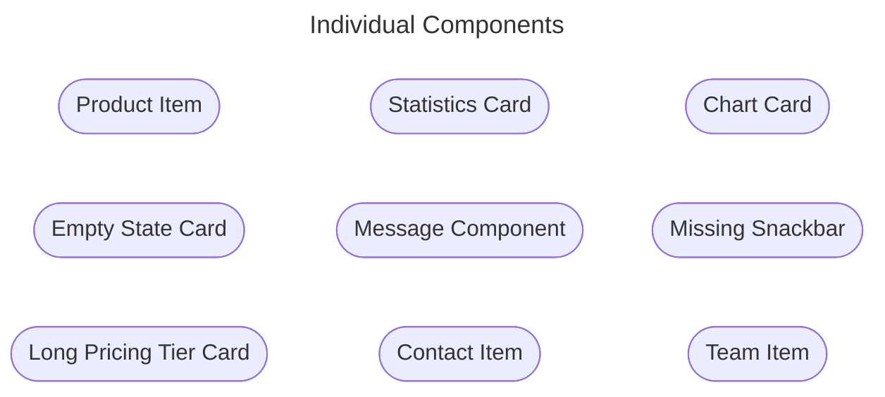
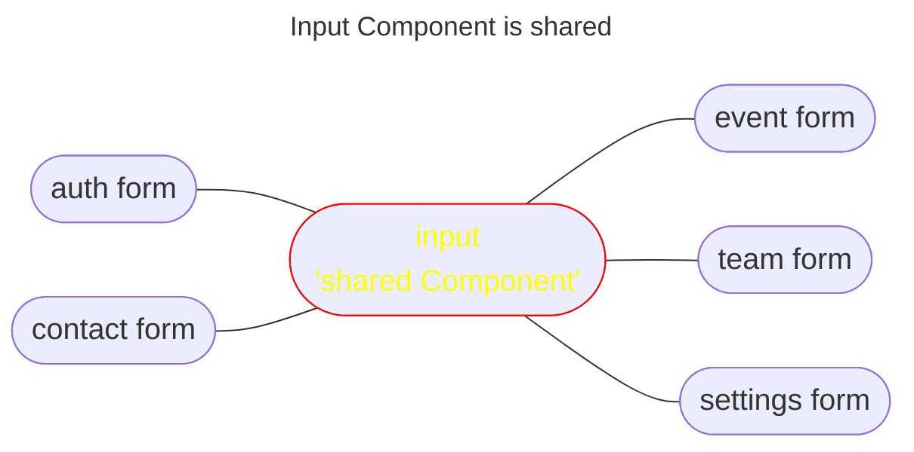
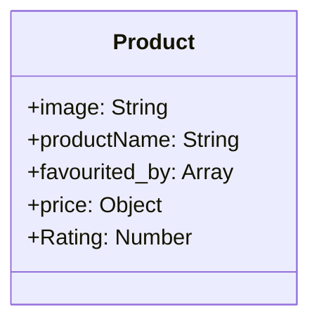
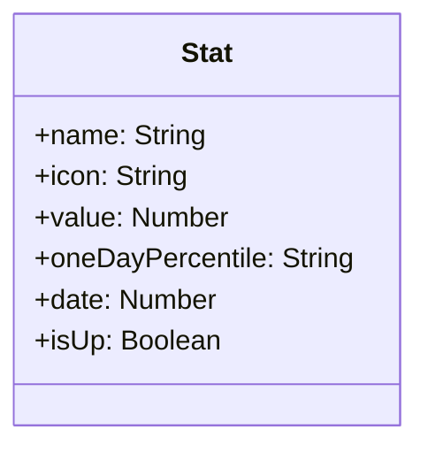
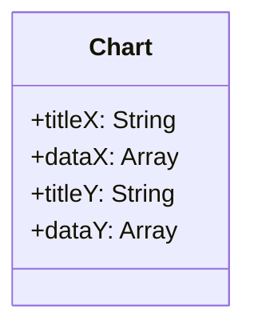
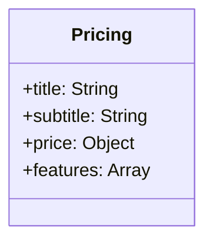
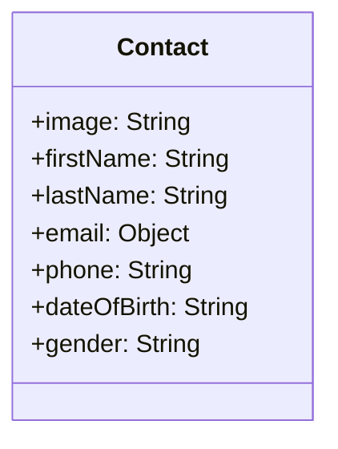
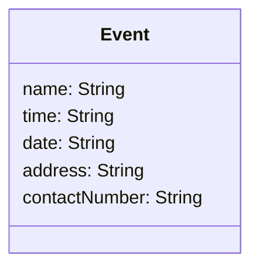
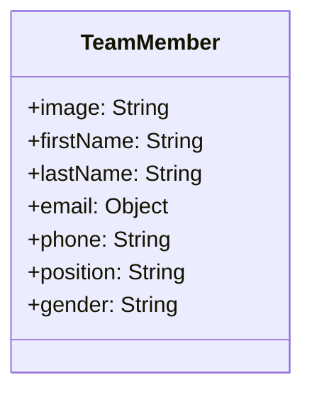

# vue3-reusablity-course

This template should help get you started developing with Vue 3 + Vuetify in Vite.

## Design Systems List
The following link shows the full list of
[all design systems](https://designsystemsrepo.com/design-systems/)

## Figma Design concept
The following link has [all figma designs](https://www.figma.com/file/Gh13ih0L96opNx0RojNhyw/Admin-Dashboard---Vue-3-Reusability-Course-(Community)?type=design&node-id=206-73&mode=design&t=uPUWTcBHIMwmUwSk-0)

## Domain Driven Testing (optional)
We can use [vitest-cucumber-plugin](https://github.com/samuel-ziegler/vitest-cucumber-plugin)

## Charts
[Charts for Vue](https://github.com/ecomfe/vue-echarts?tab=readme-ov-file#readme)


## Spotting Reusable Components in Figma
The following components can be reusable because
they are used within one or two pages:


We found that input component is shared:


The avatar also is shared across some components

## Data models
Once we spotted the components, we can extract the metadata
from the design of each component in figma.

### Product Item
Let's start with the `productItem`:


### Statistics Card
This card will have the following metadata:

### Chart Card


### Pricing Card


### Contact Details


### Event Meta


### Team Member


## Recommended IDE Setup

[VSCode](https://code.visualstudio.com/) + [Volar](https://marketplace.visualstudio.com/items?itemName=Vue.volar) (and disable Vetur) + [TypeScript Vue Plugin (Volar)](https://marketplace.visualstudio.com/items?itemName=Vue.vscode-typescript-vue-plugin).

## Type Support for `.vue` Imports in TS

TypeScript cannot handle type information for `.vue` imports by default, so we replace the `tsc` CLI with `vue-tsc` for type checking. In editors, we need [TypeScript Vue Plugin (Volar)](https://marketplace.visualstudio.com/items?itemName=Vue.vscode-typescript-vue-plugin) to make the TypeScript language service aware of `.vue` types.

If the standalone TypeScript plugin doesn't feel fast enough to you, Volar has also implemented a [Take Over Mode](https://github.com/johnsoncodehk/volar/discussions/471#discussioncomment-1361669) that is more performant. You can enable it by the following steps:

1. Disable the built-in TypeScript Extension
    1) Run `Extensions: Show Built-in Extensions` from VSCode's command palette
    2) Find `TypeScript and JavaScript Language Features`, right click and select `Disable (Workspace)`
2. Reload the VSCode window by running `Developer: Reload Window` from the command palette.

## Customize configuration

See [Vite Configuration Reference](https://vitejs.dev/config/).

## Project Setup

```sh
npm install
```

### Compile and Hot-Reload for Development

```sh
npm run dev
```

### Type-Check, Compile and Minify for Production

```sh
npm run build
```

### Run Unit Tests with [Vitest](https://vitest.dev/)

```sh
npm run test:unit
```

### Run End-to-End Tests with [Cypress](https://www.cypress.io/)

```sh
npm run test:e2e:dev
```

This runs the end-to-end tests against the Vite development server.
It is much faster than the production build.

But it's still recommended to test the production build with `test:e2e` before deploying (e.g. in CI environments):

```sh
npm run build
npm run test:e2e
```

### Lint with [ESLint](https://eslint.org/)

```sh
npm run lint
```
